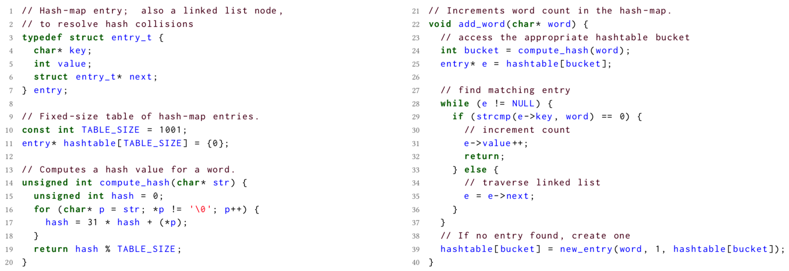

当程序提供具有最坏情况行为的输入时，软件中的性能问题可能会意外出现。大量的工作集中在通过统计分析技术诊断此类问题。但是，首先如何找到这些输入呢？

我们介绍了PerfFuzz，它是一种自动生成输入的方法. Perf-Fuzz generates inputs via feedback-directed mutational fuzzing.

## 1 INTRODUCTION

众所周知，软件的性能问题很难检测和修复。意外的性能问题可能会导致严重的项目故障并造成麻烦的安全性问题。

A particular class of inputs which would be useful to developers in alleviating these problems are pathological inputs. 

Pathological inputs病理性的 are those inputs **which exhibit worst-case algorithmic complexity** in different components of the program. 

例如，程序使用哈希表之类的数据结构和快速排序之类的排序算法。病理输入将是那些在执行时会导致哈希表中发生许多冲突或排序程序中发生许多swap的输入。

**maximize the execution count of a particular program component**.

PerfFuzz, a method to **automatically generate pathological inputs** without any domain knowledge about the program.

The key idea in PerfFuzz is to associate each program location to an input that exercises that location the most.  PerfFuzz的关键思想是将每个程序位置与最常使用该位置的输入关联起来。

### 2.1 A Motivating Example

图中的C程序是wf的简化版本，wf是一个简单的单词频率计数工具

主程序(为简便起见，从图中省略）将一个字符串作为输入，splits the string into words at whitespaces，并计算每个单词在输入中出现的次数。

First computes a hash value for that word—implemented in compute_hash (Lines 14–20)—and then attempts to find an existing entry for that word (Lines 28–37). If such an entry is found, its count is incremented (Line 31). Otherwise, a new entry is created with a count of 1 (Line 39).

至少两个性能瓶颈:

首先，如果输入中包含很长的单词（例如，核酸序列），则该程序将把大部分时间都花在compute_hash函数上。compute_hash函数遍历单词中的每个字符，而不考虑其长度。

如果输入包含许多词，哈希冲突的频率将急剧增加。对于这样的输入，程序将大部分时间花费在add_word函数中

该程序的开发人员如何识别这些性能瓶颈？如果可以使用执行上述行为的输入，则它们可以通过标准配置工具（例如GProf [32]或Valgrind [44]）运行该程序，并观察该程序花费大部分时间的源位置。他们还可以使用统计调试工具将需要较长时间处理的输入运行与快速处理的输入进行比较。或者，他们可以使用算法分析工具通过改变病理输入的大小来估计运行时的复杂性。但是，开发人员如何首先获取此类输入？

### 2.2 Performance Fuzzing

Our goal is to generate inputs that  **maximize the execution count of each edge** in the control-flow graph (CFG) of a program. 控制流图（CFG）中每个边的执行计数独立最大化的输入

在没有此类种子的情况下，我们也可以简单地从任意输入（例如空字符串或随机生成的序列）开始

(1) Initialize a set of inputs, called the parent inputs, with the given seed inputs.

(2) Pick an input from the parent inputs that maximize the exe- cution count for some CFG edge.

(3) 通过执行一个或多个随机诱变，从选定的parent输入中生成更多输入，称为child输入。这些突变包括随机翻转输入字节，插入或删除字节序列，或在父输入集中提取另一个输入的随机部分，并将其拼接在父中随机选择的位置。

(4) For each child input, run the test program and collect exe- cution counts for each CFG edge. If the child executes some edge more times than any other input seen so far (i.e., it maximizes the execution count for that edge), then add it to the set of parent inputs.

假设：

 seed input is the string "the quick brown fox jumps over the lazy dog".

perfFuzz first runs the program **with this input** and collects data about **which CFG edge**s were executed. 

For example, the function add_word is invoked 8 times, whereas the true branch of the condition on Line 29 is executed only once to increment the count for the word "the". 因为有两个"the"

开始突变：

1. character at position 18 is changed from o to i, yielding the string "the quick brown fix jumps over the lazy dog".  Running the program with this input **does not increase the execution count** for **any CFG edge**. Therefore, this input is discarded.
2. The character at position 7 (the i in quick) is replaced with a space, yielding the string "the qu ck brown fox jumps over the lazy dog". 此操作增加了字数，因此使用此输入运行wf会导致函数add_word的额外执行。 这个输入会被保存
3. The character at position 16 (the space between brown and fox) is replaced with an underscore, yielding the string "the quick brown_fox jumps over the lazy dog". 这个时候会产生哈希冲突at line 35. As this branch is executed for the first time, this input is also saved.

请注意，**最后一个突变（3）实际上减少了word的总数**，因此减少了端到端执行路径的总长度。这很重要，稍后我们将回到这一点。

An important feature of PerfFuzz is that it saves mutated inputs if they maximize the execution count for any CFG edge, **even if the mutation reduces the total execution path length**. 

## 3 THE PERFFUZZ ALGORITHM

The goal of PerfFuzz is to generate inputs which achieve high performance values associated with some program components. To **generate inputs exhibiting high computational complexity**, we take the program components to be CFG edges and **the values to be their execution counts**。

The PerfFuzz algorithm can be easily adapted to maximize a variety of values for different program components: 

1. the number of bytes allocated at malloc statements, 
2. the number of cache misses or page faults at memory load/store instructions
3. , the number of I/O operations across system components, etc.

During the execution, PerfFuzz collects feedback which includes **code coverage** information (e.g., which CFG edges were executed) as well as **values associated with the program components** of interest (e.g., how many times each CFG edge was executed). If an execution results in **new code coverage** (newCov) or if it **maximizes the value for some component** (newMax), then the corresponding input is added to the set of par- ent inputs for future fuzzing

