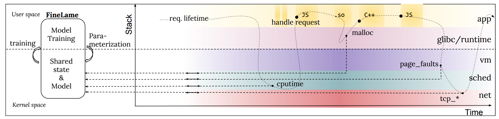

# 检测不对称的Application-layer的DDos攻击

## 摘要
This paper introduces FINELAME, a language-independent framework for detecting asymmetric DoS attacks. 

FINELAME 利用 recent advances in the Linux extended Berkeley Packet Filter virtual machine to attach application level interposition probes to key request processing functions, and lightweight resource monitors—user/kernel-level probes—to key resource allocation functions.

The data collected is used to train a model of resource utilization that occurs throughout the lifetime of individual requests. 

**The model parameters are then shared with the resource monitors**, which use them to catch offending requests in-flight, inline with resource allocation.

## 1 Introduction
传统的DoS攻击的结构很简单：攻击者在大规模的暴力攻击中发送的请求远远超出了服务的可用资源。
但多年来，已经开发出许多有效的缓解技术，包括CloudFlare，Akamai等商业服务或Arbor Networks的入侵检测系统。

针对这些防御措施，最近的攻击本质上已经变得更加复杂：它们不再依赖纯粹的数量，而是采取高度专业化，针对特定应用的非对称DoS（ADoS）攻击的形式
These attacks contain carefully-crafted, pathological payloads that target algorithmic, semantic, or implementation characteristics of the application’s internals.

For instance, the Regular-Expression DoS (正则表达式DoS) attack affects many programs that use regular expressions by leveraging algorithmic complexity to craft a single payload of a few characters that **can occupy a service for several hours**.

基于网络的防御通常对ADoS攻击无效，因为这些攻击在网络级别上缺乏可识别的问题模式。 To be successful, network tools would not only need to perform deep packet inspection, but would also need to be able to predict which requests will hog resources a priori.

本文介绍了FINELAME（Fin-Lahm）的设计和实现，这是一种用于检测ADoS攻击的实用框架。Based on the annotations, FINELAME automatically tracks CPU, memory, storage, and networking usage across the entire application (even during execution of third-party compiled binaries).

它以较低的开销和超精细的粒度来执行此操作，这使我们能够在请求离开系统之前和试图耗尽资源时检测到它们。

Enabling our approach is a recent Linux feature called extended Berkeley Packet Filter (eBPF). eBPF enables the **injection 注入** of verified pieces of code at **designated指定的** points in the operating system (OS) and/or application, regardless of the specific programming language used. 

FINELAME由在用户/内核界面上运行的三个协同组件组成。第一个组件允许将应用程序级probes附加到负责处理请求的关键功能上。 Examples of locations where those probes are attached include event handlers in a thread pool.

第二个组件将资源监视器附加到用户或内核空间的 data sources。Examples of such sources include the scheduler, TCP functions responsible for sending and receiving packets on a connection, and the memory manager used by the application.

第三个组件部署了半监督学习模型，以从收集的数据构建合法请求的模式。该模型在用户空间中训练，并且其参数与整个系统中的资源监视器共享，因此可以根据资源分配进行异常检测。

我们的评估表明，FINELAME需要较低的附加检测开销，而对Apache，Node.js和DeDOS [15]等Web应用程序进行检测则需要4-11％的附加开销

## 2 Motivation

### 2.1 Background on ADoS Attacks
从根本上说，非对称DoS攻击是利用相对较小的的攻击者资源，利用特定于应用程序的行为对系统造成不成比例的损害的攻击。

Regular-expression DoS (ReDoS) : ReDoS攻击使用正则表达式的目标程序。Attackers craft patterns that result in worst-case asymptotic behavior of a matching algorithm。示例pattern是（a +）+，它与形式为a * X的任何字符串都不匹配，但是要求系统检查模式的2N分解才能得出结论，其中N是目标字符串的长度。

XML炸弹。 XML炸弹（或Billion-Laughs攻击）是一种恶意XML文档，其中包含递归数据定义层，从而导致二次资源消耗：一个10行的XML文档可以轻松扩展为数GB的内存表示形式，并消耗服务器上过多的CPU时间和内存。图1说明了XML炸弹对易受影响服务器上请求延迟的影响。在正常操作下，每秒在不到10毫秒的时间内处理500个合法请求的负载；在每秒10枚XML炸弹的小批量攻击下，等待时间跃升至两秒以上。 XML炸弹会影响可以对引用进行编码的任何序列化格式（例如，YAML，但不包括JSON）。

Improper (de-)serialization: 这类攻击包括可以将恶意代码注入正在运行的服务的那些攻击。不幸的是，这些漏洞在实践中很常见，并且它们使恶意用户例如可以注入for（;;）{}循环来无限期地暂停进程。

Event-handler Poisoning (EHP) : 可以在事件驱动的框架中进一步放大上述攻击。**攻击者利用事件驱动框架的阻塞属性，以便当请求不公平地支配事件处理程序所花费的时间时**，将进一步阻止其他客户端继续处理。任何速度下降，无论是在服务本身中还是在第三方库的递归层中，都可能导致此行头阻塞。

### 2.2 Design Goals
本系统设计的目标。

1. In-flight Detection: DoS detection needs to catch such requests before they leave the system, by monitoring resource consumption at a very fine temporal and spatial granularity.

2. Resource Independence. ADoS攻击可能针对任意系统级资源（CPU，内存，存储或网络），甚至可能针对多个资源（即多向量攻击）。理想的解决方案需要与资源无关

3. Cross-component Tracking. For instance, if a request causes the triggering of a timeout to an event queue, resources consumed by the initial request parsing and the timeout should both be attributed to the same request.

## 4 FINELAME设计

FINELAME consists of three main components:
1. 程序员注释annotations，用于标记何时处理请求。即使对于复杂的应用程序，FINELAME也只需要几个注释即可将资源利用率正确地分配给请求。
2. 细粒度的资源监视器，以上下文切换，malloc，页面错误的粒度跟踪运行中请求的资源利用率。
3. 一种跨layer异常检测模型，用于学习合法行为并在攻击偏离此类行为后立即对其进行检测。

程序员可以通过使用我们所谓的request-mappers注释其应用程序来使用FINELAME。这些注释针对每个组件和处理阶段描述了处理的开始和结束以及应将资源利用归因于此的请求。例如，在事件驱动的框架中，事件处理程序循环的每次迭代的开始和结束应分别标记为请求处理的开始和结束。

在运行时，将FINELAME安装在主机环境上时，FINELAME会将小型，低开销的资源监视器附加到应用程序或操作系统中的特定点。The request-mappers enable FINELAME to determine the request to which the resource consumed by a thread or process should be credited.

最后，FINELAME的监视数据用于执行轻量级的内联异常检测。资源监视器首先将数据输入到机器学习模型训练框架,训练后的模型的参数直接安装到资源监视器中，资源监视器评估模型的近似值以自动实时检测异常行为。

### 4.1 Request-mapping in FINELAME
there are three operations in request mapping:

