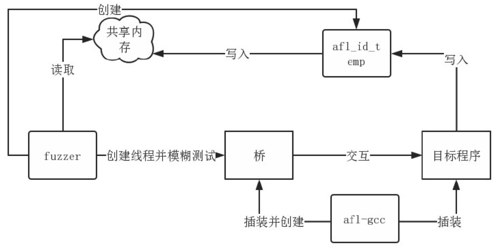
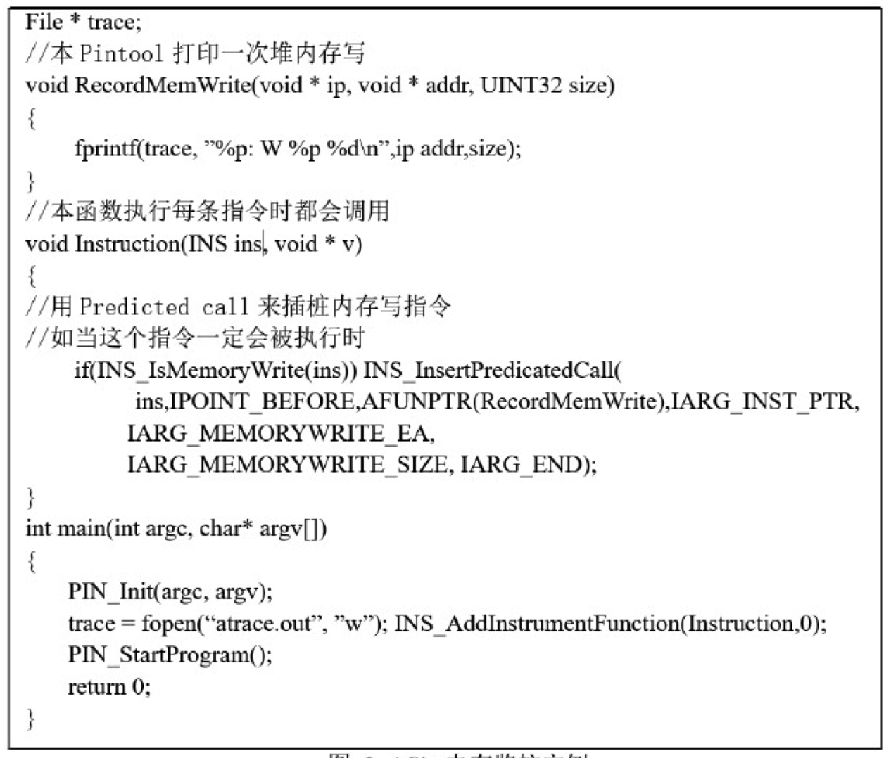

# 二进制代码相似性检测

模糊测试可以生成许多高质量的输入，越是先进的模糊测试越是能保证高覆盖率，这点与随机生成的输入相比拥有非常大的优势。

另一方面，模糊测试每次都从函数或程序的入口开始执行

糊测试原本的设计目标是为了通过不断地**输入不同的输入**来让二进制程序暴露更多的错误或者漏洞。然而从本质上。

模糊测试最本质的过程可以看作是生成能在运行时覆盖更多代码的输入的过程。

作为模糊测试中最核心的部分，对程序输入的变异策略是模糊测试达到高覆盖率最核心的手段：

具体而言，
AFL 
视具体情况启发式的从下列输入变异策略中选取
一个：

1)  按位翻转（bitflip）：即随机将 0 变为 1，将 1 变为 0

2)  算术加减（arithmetic）：即随机在当前输入上加上或减去一个数。

3)  特殊替换（interest）：即将一些特殊的内容随机替换到原文件中。

4)  字典替换（dictionary）：即将用户自定义或自动生成的内容替换到原文件中。

5)  破坏（haboc）：以上几种变异策略的随机组合。

6)  连接（splice）：将两个文件合并为一个文件。

除了以上的变异策略，对于提高输入覆盖率，AFL 还维护了一个由变异文件所组成的队列，如果队列中的某个输入文件使得模糊测试**执行了之前从未被执行过的代码或指令**，那么这个文件就会被格外重视，并且在后续的变异过程中被着重变异。

基本原理：

对待比较的两个二进制程序进行二进制插桩，目的是为了让其能输出后续所需要的核心值。插桩完毕之后，用之前所生成的**输入队列去反复执行被插桩的二进制程序**，并搜集二进制程序运行过程中所产生的核心值。

其中的模糊测试模块是基于改编之后的 AFL，其目的在于产生大量高代码覆盖率的输入。

afl-gcc 作为编译器中间层，在编译过程中的汇编代码阶段识别出每个基本块（Basic Block），并给每个基本块一个随机的编号来表示这个基本块。

AFL 使用两个基本块之间的异或来表示程序在具体执行的过程中从其中一个基本块（A）跳转到了另外一个基本块（B）.并依据此在共享内存相应的异或结果所对应的地方加一来表示这个跳转。

**插桩完毕**之后，**每一次**执行中，每出现一次**基本块之间的跳转**，AFL 便会向共享内存中所对应的异或结果的地方加 
1（初始化为 0）。

这样在不同的执行之间，如果共享内存不同，那么就意味着程序在这次执行中，执行到了新的代码。那么结合之前介绍的输入变异策略，便会对不同的变异产生的输入赋予不同的权值，其中使得共享内存变化最大的输入会被着重变异，即权值更大。

### 动态二进制插桩

Pin 作为一个即时（Just In Time）动态二进制插桩框架，外部的插桩代码每次在**被插桩的指令**即将被指令执行之前，会动态的**截断控制流**并**转向用户代码**。
Pin 提供的 API 允许查看，如寄存器内容，内存以及数据流等进程的所有的底层结构。

对于 Pin 的核心组件，即即时（Just In Time）编译器
**这个编译器的输入并不是字节码，而是一个完整的可执行程序**。
Pin 从第一条指令开始就截断输入的二进制程序的执行，并且生成新的指令插入目标程序原生指令之前。并将控制流传递给被生成的指令。

**每当即时编译器获取一些基本块时**，Pin便有机会在这些基本块被执行之前插入一些代码。这些被插桩好的代码会被保存在代码缓存中为今后的执行所用，并以此来提高性能。

这是一个典型的追踪内存写的 Pintool。具体而言，该 Pintool 打印**每个在运行时被更新的内存地址**，以及更新值的大小。主函数完成了 Pin 的初始化，并注册了一个名叫 Instruction 的过程

