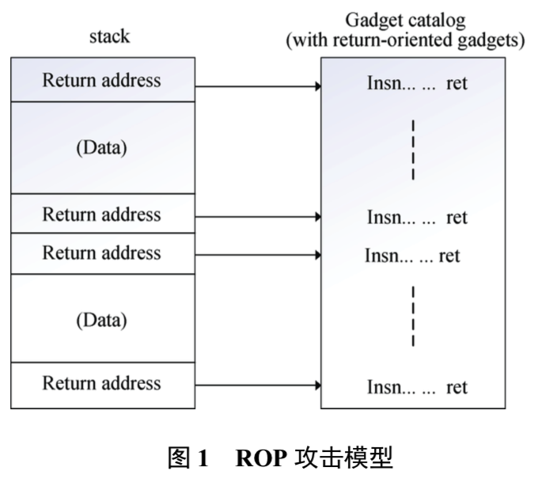

### 摘要：

攻击者在 无法通过向内存中注入自己的代码并执行的方式完成攻击后, 开始利用内存中原有的代码, 通过控制它们执行的顺序来达到自 己的目的, 这种攻击方式称为代码重用攻击, 它具有极大的威胁性, 能够绕过多种现行的安全措施, 并成为攻击者的主流攻击 方式。为此, 研究界针对代码重用攻击的研究也逐渐增多。


由于在 C 与 C++等计算机程序中普遍存在漏洞, 例如能够对内存的直接存取; 对用户的输入没有自动的边界检查机制, 以及对已经释放的指针再利用 等[1]。

使攻击者能够利用这些漏洞通过 溢出没有边界检查机制的缓冲区来注入恶意代码并篡改内存的函数返回地址, 改变程序控制流使注入的代码得到执行, 这就是最早的代码注入攻击。

在此之上又发展出了整数溢出、格式化字符串溢出等攻击方式, 实现原理基本相同。


近年来, 另一种攻击方式开始兴起。一些攻击者开始利用程序在内存 中原有的代码, 通过利用漏洞改变它们的执行顺序 来达到攻击的目的, 这就是所谓的代码重用攻击 (Code-reuse Attack)。

这些攻击方式依然能够达到与传统的代码注入攻击相 同的攻击效果, 能够使攻击者执行任意代码。因此目 前对于计算机系统安全性的保护依然不容乐观, 研 究界对于代码重用攻击的防御提出了各种各样的安 全机制, 然而都存在安全性或性能、兼容性缺陷, 无 法达到令人满意的效果。

## 2 代码重用攻击概述与国内外研究现状

代码注入与代码重用都属于对计算机系统漏洞进行利用的攻击方式。他们的区别在于攻击者执行恶意代码的方式, 前者通过直接向内存中注入恶意代码并执行; 后者利用内存中原有的代码, 通过篡改控制指令执行的数据, 改变了指令原有的执行顺序, 使其按照攻击者的意志执行, 达成攻击目标。


目前代码重用攻击有 Return-to-Libc、ROP、JOP 等具体形式。


### 2.1 Return-to-Libc 攻击 

若攻击者能够获悉程序所使用的库函数的地址,便可以用其地址来覆盖程序中某个函数的返回值, 并将调用库函数所需要的参数以正确的顺序添加至覆盖区内, 这样程序在该函数返回后就会执行相应的库函数, 例如调出一个shell。这种攻击方式能使攻击者可以使用任意的参数调用内存中任意的库函数。


### 2.2 Return Orient Programming功击

OP 是在 Return-to-Libc 攻击的基础上逐步发展 起来的, 能够实现任意程序行为(图灵完备)的攻击方式。

ROP 攻击与函数调用和返回机制有极大的联系。以 x86 架构程序为例, call 与 ret 指令在程序的执行过程中总是一一对应的。在执行 call 指令时, CPU 会将 call 指令的下一条指令地址压栈作为返回地址, 然后跳转到 call 所指示的位置。在 ret 指令执行时, CPU 会自动将预先保存在栈中的返回地址弹给 eip寄存器, 继续执行原有 call 指令之后的指令。

```
CALL 指令调用一个过程，指挥处理器从新的内存地址开始执行。过程使用 RET（从过程返回）指令将处理器转回到该过程被调用的程序点上。
```

这个操作不会对 call 的下一条指令的正确性进行检查或保障。




如图一所示, 首先在原有代码中搜索一些短小的指令序列, 这些序列都能完成一定的功能, 例如运算或赋值, 然后以

ret 指令为结尾, 称为配件(gadget)。攻击者依据要执行的配件的顺序与所需的参数, 将这些配件的地址与参数进行拼接, 构建一条配件链(gadget chain)。并通过栈溢出漏洞将这条配件链注入到栈中覆盖当前或其他某个函数的返回地址。一旦返回地址被覆盖的函数返回, 那么 CPU 就会按照栈中攻击者存放的配件地址链进行跳转, 不断的从一个配件返回并跳转到下一个配件执行[14]。ROP 攻击极为灵活, 在发展演变的过程中出现了许多变种与新的实现方式,并配合内存泄露攻击, 能够绕过多种专门针对它的 防御机制


### 2.3 JOP(Jump-Oriented Programming)攻击


## 3 基于程序异常行为监测的防御机制

代码重用攻击的实现需要两大重要环节, 一个 是控制流的劫持, 另外一个是对内存中的代码位置 的获悉。首先得到内存中的代码位置, 构建控制程序 执行的配件地址链, 而后通过对溢出漏洞将配件链 注入到内存的数据区中, 最后劫持控制流使得程序 按照攻击者注入的配件顺序执行。因此防御措施也 就分别针对这两个重要环节, 监测程序的异常行为 与增加程序的不可知性。


目前的针对程序异常行为的监测防御机制中, 大致分为两种方法, 一种是对 ROP/JOP 攻击中配件 出现频率的监测; 另一种是对程序控制流正确性的 保障与监测。


### 3.1 对于配件出现频率的检测 

研究者在观察代码重用攻击(这里以 ROP 攻击为例)发生时的程序行为时发现, 发生ROP攻击的程 序行为与正常程序行为有着明显不同。在 ROP 攻击 的过程中, 攻击者通过将许多以 ret 指令为结尾的配件连接起来完成攻击, 这些配件大都较短, 在一定 长度以内, 当 ROP 攻击发生时程序指令流中会出现 大量 ret 指令。因此监测一段指令当中 ret 指令出现 的频率, 就成为了一种监测 ROP 攻击的方式。然而 这种方式只能对 ROP 攻击产生效果, 无法防御 Return-to-Libc 攻击。


Pappas 等人利用 Intel 处理器中自带的 LBR (Last Branch Recording)机制来对程序中的间接跳转进行检测, 保证所有的 ret 指令返回目标指令都位于一条 call 指令之后, 这种方式可以防御简单的 Return-to-Libc 与 ROP 攻击

利用对 LBR 中存储的 跳转指令的地址进行分析, 分析这些地址之间的 紧密程度来判断是否出现了一串以 ret 为结尾的配 件链, 从而判断是否出现了 ROP 攻击


### 3.2 基于保障控制流完整性思想的防御机制

类比与对配件出现频率进行监测的方法, 保障间接转移指令目标地址的正确性是目前更为有效的方法, 这里需要指出的是。

转移指令分为直接转移 和间接转移两大类, 直接转移指令的目的地址是在编译链接阶段就已经确定并写入二进制代码中的, 在程序运行时无法更改; 间接转移指令在运行时对 具体的寄存器或内存进行间接寻址, 这些间接转移 指令的目标可能是动态变化的, 因此存在被攻击者 篡改并劫持的可能性, 故所有保障控制流完整性的 机制都是针对间接转移指令的。


#### 3.2.1 细粒度 CFI 的最早提出与探讨

Control-Flow Integrity 是最早提出保障控制流完整性(Control-Flow Integrity,CFI)思想的文章, 

首先将要执行的代 码进行静态分析, 画出控制流图, 预先计算出所有 的间接转移指令的可能的目标地址, 并为之配唯一 的 ID。改写程序的二进制代码, 在每一条间接跳转 指令执行之前增加检查逻辑, 一旦出现违反控制流 图的间接跳转就会报错并终止程序。这种为每一个 转移目标地址分配唯一 ID 的实现思想我们称之为细 粒度 CFI。它在被提出时被认为具有极佳的安全性, 能够检测出任何代码重用攻击并使用纯软件方式实 现, 得到了研究界广泛的重视与探讨, 并出现了不 少具体的实现方案。

细粒度 CFI 在提出之后之所以一直没有得到广 泛的应用, 是由于其本身还存在不少问题, 比如:

1. 针对诸如内核程序上百万行的代码, 以及其 他的大规模的程序, 如何精确的画出其控制流图, 仍然是一个亟待解决的问题。

2. 传统的细粒度 CFI 要求在程序载入内存之前 需要对所有的程序模块进行分析并重写二进制代码 加入检查指令, 包括动态链接库, 那么每个程序就 只能在载入时带着它们自己重写好后的库了, 无法与其他的程序共享, 这与动态链接库的设计初衷相 悖。

3. 纯软件的 CFI 实现方式性能损耗较高。在 20%至 50%左右。


### ELSE

ESP为栈指针，用于指向栈的栈顶（下一个压入栈的活动记录的顶部）

```
#include <stdio.h>

int func(int param1 ,int param2,int param3)
{
        int var1 = param1;
        int var2 = param2;
        int var3 = param3;
 
        printf("var1=d,var2=d,var3=d",var1,var2,var3);
        return var1;
}
 
int main(int argc, char* argv[])
{
        int result = func(1,2,3);
 
        return 0; 
}
```

EBP是指向栈底的指针，在过程调用中不变，又称为帧指针。ESP指向栈顶

