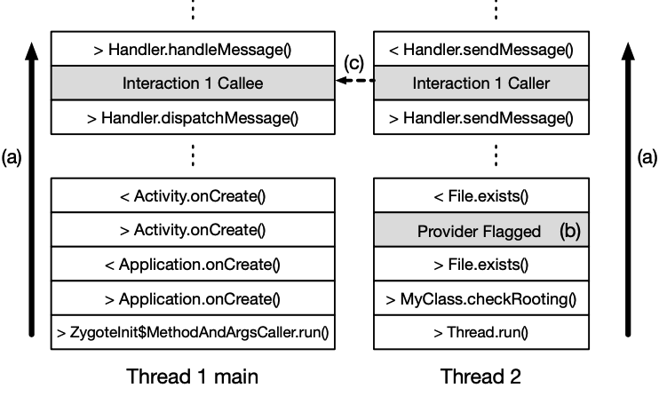

# Breaking Ad-hoc Runtime Integrity Protection Mechanisms in Android Financial Apps

为了保护客户的敏感信息，许多移动金融应用都包含了探查运行时环境的步骤，如果认为环境被篡改，就会中止其执行。本文调查了韩国76个流行的金融Android应用中使用的这种自我防御机制的安全性。

Our investigation found that existing tools fail to analyze these Android apps effectively because of their highly代码高度混淆，控制流程复杂、非传统. We overcome this challenge by extracting a call graph with a self-defense mechanism, from a detailed runtime trace record of a target app’s execution.

To generate the call graph, we identify the causality因果关系 between the system APIs (Android APIs and system calls) used to check device rooting and app integrity, and those used to stop an app’s execution. 

我们对76个应用的分析表明，在大多数情况下，我们可以利用因果关系图精确地指出绕过自我防御机制的方法。我们成功绕过了73个检查设备root的应用中的67个应用   和   44个检查应用完整性的应用中的39个应用   的自卫机制。

在分析自防御机制的同时，我们发现很多应用的自防御机制依赖于第三方安全库。因此，我们对五大安全库进行了深入研究。


## 1 INTRODUCTION

为了保护用户的金融服务，移动金融应用使用了额外的安全层，如双因素认证[40]，或一次性密码[10]。虽然这些安全措施在一定程度上是有益的，但如果一个应用的平台被入侵，任何应用层面的措施都可以被绕过，从而对各种已知的攻击变得无效， including root-exploit attacks, app-repackaging attacks, and memory-dumping attacks [49]. 


原则上，没有一个万无一失的解决方案可以协助Android应用确定它们运行的设备是否已经被root，或者应用本身的二进制是否已经被修改。尽管如此，我们观察到许多Android金融应用似乎采用了一些机制，检查篡改的证据，然后在检测到可疑的东西时，用警告信息中止执行。

在本文中，我们将这些机制称为**自我防御机制**。尽管这些机制被广泛使用，但人们对这些机制是如何设计的，以及它们在实践中是否有效却知之甚少。


我们实现了MEthod Recorder with Connecting Indirect relations (MERCIDroid)，这是一个能跟踪app的控制流的en- hanced Android平台。 To get the call graph, the tool first records a detailed runtime trace of a target app’s execution, including the indirect relationships between threads and components.

从记录的数据中，该工具通过识别Android API和各部分使用的系统调用，找到检查设备root和应用篡改的环境调查和阻止应用执行的执行终止之间的因果关系。

我们的分析表明，这些应用只查看了a limited set of characteristics of rooted platforms and tampered apps，比如是否存在与设备root相关的文件或应用包文件的哈希值。此外，一旦自我防御机制被识别出来，绕过它们只需要修改几行字节码或原生代码native code。

应用程序共享相同的自卫机制代码。（三方库）

为了了解这些安全库的有效性，我们对所研究的应用程序中使用的五个流行安全库进行了深入的案例研究。我们发现，大多数库都有相同的弱点。


## 2. DESIGN CHARACTERISTICS OF SELF-DEFENSE MECHANISMS

```
int i = Lib0.check(this);
```

调用本地方法Lib0.check()来检查设备是否被root(第4行)。

如果check()返回一个正整数，意味着设备已经被root。

如果check()没有检测到设备已被root，onResume()会调用另一个方法来检查设备是否已被root（


We found that 93% of the self-defense mechanisms in our analysis follow this structure：

1. 首先，一个方法，我们将其标记为common ancestor，调用环境调查调查应用二进制和应用安装的平台

2. This **environment investigation** then calls **environment information providers**, which provide the system environment variables necessary for the check. 
3. Based on the values returned, the environment investigation decides the app’s integrity and/or de- vice rooting and returns the result to the common ancestor method
4. 。如果执行环境被认为是不安全的，common ancestor方法就会调用代码来终止应用程序


### 2.1 Environment investigation

环境调查的作用是获取执行环境的信息（如是否存在特定的文件、包信息），决定环境是否不安全。

For example, an app checks for device rooting by scanning for the existence of the *su* binary or permission management apps such as *SuperSu*. 

为了检查应用的完整性，应用可能会检查Android应用包（APK）文件的路径及其标志

environment information providers可以分为两类。Android APIs和Linux系统调用。根据对已知技术的调查[1，35]，我们选择了表1和表2所示的Android API和系统调用作为environment information providers。


### 2.3 Challenges to locating self-defense mech- anisms


TODO：


### 3.1 Key Insight

为了缩小要调查的代码路径，

The key insight for improving the accuracy of locating self-defense mechanisms 是利用运行时记录的控制流图中environment information providers 和 the execution terminator之间的因果关系。

为了构建call graph，我们执行以下步骤。首先，我们记录目标应用程序执行时的所有调用（Java方法和native function）和返回。在跟踪的同时，我们记录了额外的信息，以连接线程和Android组件之间的间接关系，并识别environment information providers 。其次，当执行终止器被调用时，我们将记录的数据冲入一个文件。最后，我们对记录进行解析，找到识别出的环境信息提供者和执行终结者之间的共同祖先，并找到最接近执行终结者的共同祖先。


### 3.2 Tool Design and Implementation

In order to locate common ancestors between environment information providers and execution terminators, **we need to track caller-callee relationships across threads, components, and process boundaries**.


 1) collecting control flow information by tracing calls at runtime; 

 2) extracting a call graph containing the methods related to a self-defense mechanism.


#### 3.2.1 在运行时记录方法调用
为了在运行时记录应用程序的方法调用，我们修改了Android 4.4.4。

们专注于Android 4.4.4使用的Dalvik虚拟机（VM）因为Android 4.4.4仍然是最广泛使用的版本[7]。更高版本的Android使用Android Runtime(ART)，取代了Dalvik VM。

们只有一个金融应用需要高于4.4的版本。
修改后的系统记录了方法调用以及线程和组件之间的间接关系，如图3所述：



each method call/return is stored from the bottom to top (a)

An environment information provider that meets the condition is flagged (b).

The indirect caller and callee are connected through an inter- action ID (c).


**Recording method calls per thread:**we modified the Dalvik VM to record the method calls in each thread. We modified a portable C implementation of mterp, the interpreter that interprets and executes Dalvik bytecode. 特别是，我们关注的是调用和返回指令，它们分别与方法调用和返回有关。


Flagging relevant environment information provider calls: MERCIDroid uses runtime arguments to check the investigating conditions. If the condition holds, MERCIDroid adds an extra record between the method invocation and the method return to flag the method call as shown in Figure 3(b).

Also, to flag environment information providers whose type is a system call, MERCIDroid executes strace and parses the result.


Finding indirect relationships of method calls: 只追踪直接的调用者与被调用者的关系，不足以生成一个包含自我防御机制的调用图。

例如，一个操纵UI的线程必须使用Handler.sendMessage(Message msg) 向UI线程发送一个Message。然后，在UI线程中，Handler.dispatchMessage(Message msg)调用另一个方法来处理该消息。在这种情况下，sendMessage(Message msg)和dispatchMessage(Message msg)不是直接的调用者与被调用者的关系。因此，为了连接这两个方法调用，我们需要更多的信息。

To connect the indirect caller-callee relationships, MERCIDroid allocates a unique ID to **a message object** that both the caller and the callee use. MERCIDroid adds a unique ID to a Message object such that we can link the method calls with a Message object by checking its ID. 


### 3.2.2 Constructing a call graph

By narrowing the scope of the methods to those in the SDMGraph, we can manually disassemble and analyze a small number of methods to find one that we can modify to bypass the self-defense mecha- nisms. 


## 4 APP ANALYSIS & BYPASS ATTACKS

### 4.1 App Selection

我们从大韩民国Google Play "金融、免费 "类别中截至2016年1月的前400款应用开始。为了覆盖从热门到不常使用的多样化应用，我们从400个应用中随机挑选了200个应用，而不是讲解前200个应用。需要注意的是，分析金融类应用需要设置信用或银行账户，因此我们不得不限制分析的应用数量。

为了找到包含自卫机制的应用程序，我们通过以下步骤进行分析。首先，为了找到检查设备root的应用程序，我们将每个应用程序安装在已root的设备上并执行。

为了找到执行应用二进制完整性检查的应用，我们拆解了应用二进制，在代码中添加了一个空类，重新组装了应用的DEX文件，并执行修改后的应用二进制。（we disassembled the app binary, added an empty class to the code, reassembled a DEX file of the app, and executed the modified app binary.）如果应用的执行被阻止，我们就认为该应用执行了一种自我防御机制，并将其加入到应用列表中进行分析。

我们发现有76个应用程序执行了一种或多种自卫机制：76个应用程序中的73个检查设备root，76个应用程序中的44个检查应用程序的完整性。


### 4.2 Traits of Self-defense Mechanisms

#### 4.2.1 Device rooting checks

*R_Group_API.*

Apps in this group use Java methods to check device rooting. They use the Android APIs in Table 1 to detect the existence of binaries or apps related to device rooting.

例如，一些应用程序分别使用File.exences()或Runtime.exec()方法来检查 "su "二进制文件或命令的存在。应用程序还使用PackageManager.getPackageInfo()来检查是否安装了与设备root相关的应用程序（如SuperSU）


How to bypass: We modify an argument or the return value of an Android API (Figure 4a or 4b). We change the name of a file the apps try to find (e.g., “su” to “us”) or fix the return value to *false*, based on the property of the API.


R_Group_Native_Predictable_Return.
This group contains apps that check device rooting in native libraries. The Java code in the apps includes the declaration of the native methods mapped to functions in native libraries. The apps use the native functions by calling the native methods. For exam- ple, apps use open() or stat() to check for the existence of the “su” binary. 

How to bypass. We change the native method’s declaration to a fake Java method that returns a fixed value


*R_Group_Native_Unpredictable_Return.*

Device rooting checks for apps in this group are similar to those in *R_Group_Native_Predictable_Return*, except that the native methods return unpredictable values. If a native method returns a byte array or a string that contains randomly generated values, predicting the value when a device is not rooted and overwriting the return value is difficult.

How to bypass. In this case, we modify the native code directly using IDA Proto rewrite bytes in the text section to skip the check.


### 4.3 Third-party Security Libraries

在仔细检查后，我们发现有60个(76个中)的应用程序内嵌了一个或多个实现自我防御机制的安全库，我们利用Java包名和库的文件名来推断生产库的安全公司。我们使用Java包名和库的文件名来推断生产库的安全公司。
表5显示了这些库和库所支持的附加安全功能。除Lib8外，其他库都是用本地代码编写的。从库的代码和安全公司的网页上，我们发现这些库提供了除自卫机制以外的各种安全功能。这些库提供的最主要功能是恶意软件检测。这些库通过从系统中获取已安装的应用和正在运行的进程列表，直接扫描恶意应用和进程，或者通过与同一厂商开发的安全应用进行交易扫描。同时，这些库还支持各种功能，如代码混淆、反反编译、模拟器检测等，以防止应用的逆向工程。
我们发现，有些库在运行自我防御机制时，会与外部服务器进行通信。如第2节所述，这些库将数据或检查结果发送给服务器进行验证，这就导致了复杂的调用图。


Lib0. We found two ways that Lib0 checks device rooting. First, the library checks predictable file paths in the su binary (e.g., /sys- tem/xbin/su, /system/bin/su) using the stat() [13] system call.  其次，库检查adbd进程的用户ID。库通过扫描/proc/ direc- tory找到adbd的进程ID，该目录包含了许多由进程ID命名的运行进程的子目录[13]。然后，库通过read()系统调用读取/proc/[pid]/status文件来获取adbd进程的用户ID。如果设备没有root，adbd的用户ID为2000，也就是shell用户的ID。否则，adbd的用户ID为0，也就是root用户的ID。因此，该库可以用adbd的用户ID来检查设备是否被root。


这些库使用类似于第4.2节中描述的方法来检查应用程序的完整性；它们获取应用程序的APK文件路径，读取文件，计算哈希值，并将该值与存储在外部服务器中的值进行比较。即使库是用原生代码编写的，它们也总是使用Android APIs获取APK文件路径，因为路径因设备而异。

 Lib2 reads the app’s APK file and library file. The library takes the files’ paths as string-type arguments. The library first checks whether the APK file’s path is valid

The library then reads the files, calculates the hash values, and sends them to the app developer’s server for the validation of app integrity.


**How an app finds out whether the self-defense mecha- nism had been called**

Although the libraries use various methods to check device rooting and app integrity, almost none of the apps or libraries verify after the checks that the checks were performed. 

So, if we skip the checks, then the app can get the signal from the server. 


Lib0. If the device is not rooted, Lib0’s native method returns zero. Otherwise, the method returns -1. We bypass the check by changing the native method’s declaration to a Java method that returns zero.

Lib1. Lib1’s native method for a device rooting check returns a string “0” when the device is not rooted. Otherwise, the method returns “1.” We bypass the check by changing the native method’s declaration to a Java method that returns “0.”