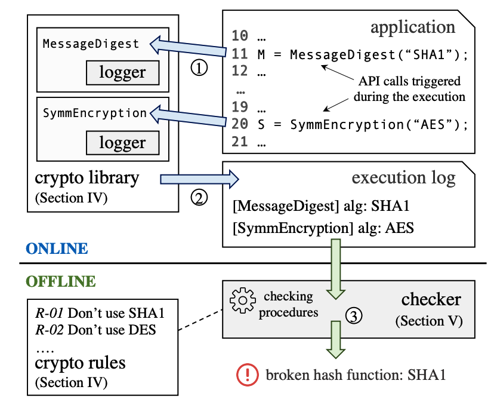

Detecting Crypto Misuses Dynamically

## 摘要

This paper presents CRYLOGGER, the first open-source tool to detect crypto misuses dynamically.

CRYLOGGER logs the parameters that are passed to the crypto APIs during the execution and checks their legitimacy offline by using a list of crypto rules.

I. INTRODUCTION

Egele等人[5]的研究表明，他们从Google Play商店下载的Android应用中，88%的应用至少存在一次加密误用。

At the same time, researchers started to implement tools to automatically detect crypto misuses, e.g., [5], [6]. The idea is to define a set of *crypto rules* and check if an application respects them by verifying the parameters passed to the crypto APIs. 

The rules usually come from (i) papers that show the vulnerabilities caused by some crypto algorithms or their misconfigurations, e.g., [12], and (ii) organizations and agencies, e.g., NIST and IETF, that define crypto-related standards to prevent attacks. 

Examples of crypto rules are setting (i) a minimum key size for encryption, e.g., 2048 bits for RSA [13] or (ii) a minimum number of iterations for key derivation, e.g., 1000 for PKCS#5 [14].

The key insights of this work are: 

(1) we log the relevant parameters of the crypto API calls by instrumenting few classes that are used by a large number of applications; 

(2) we log the values of the parameters of the crypto APIs at runtime, while we check the rules offline to reduce the impact on the applications performance;

 (3) we show that, for most Android apps, the calls to the crypto APIs can be easily triggered at runtime, and thus a dynamic approach can be effective in detecting misuses even if the code of the applications has not been explored entirely; 

(4) we show that, for Android apps, it is sufficient to execute an application for a relatively short amount of time to find many of the crypto misuses that are reported by the current static tools.

## II. OVERVIEW

1. logger: the logger extends a crypto library, for example the Java crypto library, to trace the API calls to crypto algorithms; **for each of these calls, it logs the relevant parameters that must be used** to check the crypto rules; for example, in Fig. 1, the logger saves the names of the algorithms chosen by the application for message digest (SHA1) and symmetric encryption (AES); 
2. checker: the checker analyzes the log offline, after the application has been executed, and it produces a list of all the crypto rules violated by the application. **To check the rules it uses a set of checking procedures, each of which covers many crypto rules**; for instance, in Fig. 1, the checker finds that the application uses the broken algorithm SHA1 as message digest algorithm.

III. RELATED WORK

Several tools exist to detect crypto misuses. Most of them are based on static analysis 

As discussed in [27], the main problem with static analysis is the high number of false positives, which requires the users to manually examine the results and determine the true positives.

pseudo 伪

Analyzing Android apps dynamically and automatically is considered a hard problem [37], [38]. The common solution to verify the apps correctness is Monkey1 . Monkey generates pseudo-random events that interact with the GUI of the emulator or the real device. Monkey often obtains low code coverage because the events are completely random [39], but it is quite efficient in terms of execution time. O

## IV. CRYPTO LIBRARY AND CRYPTO RULES

A typical crypto library (e.g., Java Cryptography Architecture) includes 7 classes of tasks: 

(1) message digest: MessageDigest implements crypto hash functions [43]. These functions take as input an arbitrary amount of data and produce **fixed-length hash values, called digests**. They are used to check data integrity. For this class, the most important parameter is the algorithm (alg) that is used as hash function, for example, SHA1, SHA256. Different libraries support different algorithms.

(2) symmetric encryption, ：

通常密钥都很小，然而矛盾的是，大部分时候需要加密的内容都很长。几个字节的密钥长度与几百 M 大小的文件，如何是用长度很短的密钥把长度很长的文件加密呢？

• 将长的一方，变短。**把明文分组，分块。分成一个一个块，这个块大小符合加密算法所需要的明文大小。**这就是大家经常听到的分组加密，**分块加密**。

(3) asymmetric encryption, 

(4) key derivation/generation, 

(5) random number generation, 

(6) key storage, 

(7) SSL/TLS and certificates. 

