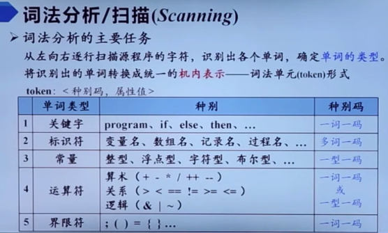
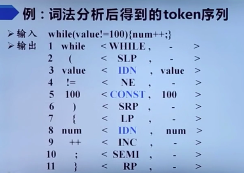
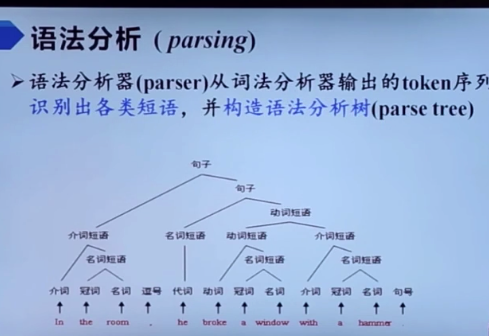
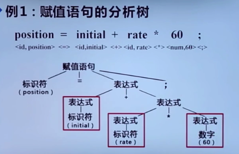
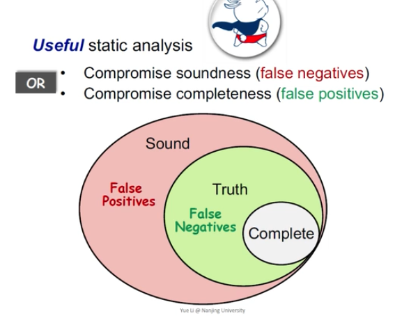
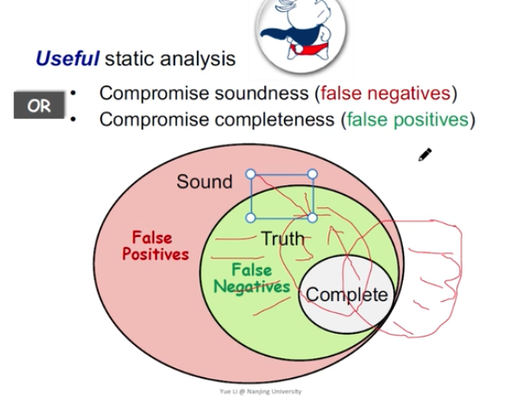
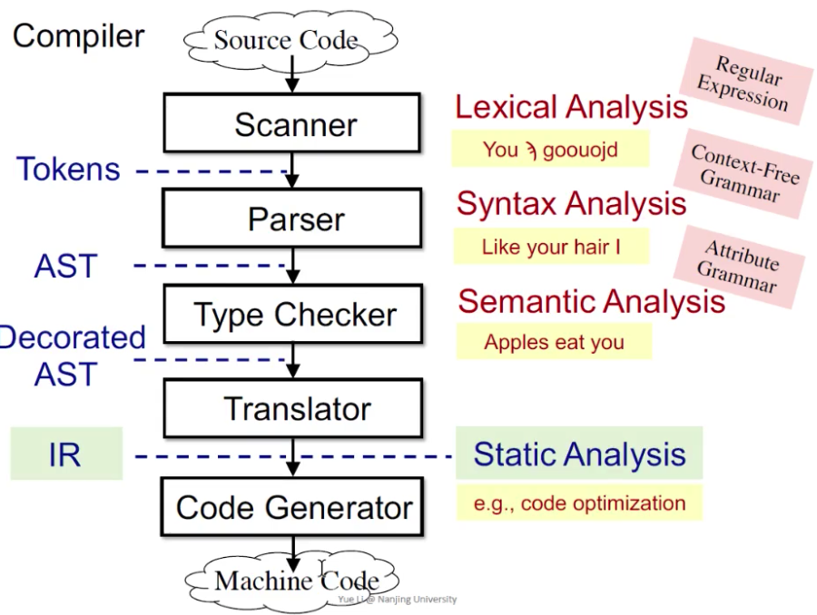

# 1 编译器的结构

### 1.1 词法分析

词法分析是编译的第一个阶段

种别码理论上应该是一个整数，这里只是为了直观用宏定义，IDN代表符号，while SLP都是一词一码的符号，所以属性值都可以是空的

### 1.2 语法分析

输入一个赋值语句

经过词法分析，得到一个token序列，id代表标识符

### 1.3 语义分析（第三个阶段）

对于声明型语句来说，语义分析的主要任务就是收集标识符的属性信息，把它们放到符号表里去

符号表的Name字段被分成两个部分，一部分用来存放**标识符在字符串表中的起始位置**，另一部分用来存放标识符的长度

#### 问题：符号表中为什么要设计字符串表这样一种数据结构？

语义分析的另一个任务就是语义检查：

1. 未经声明就适用
2. 重复声明
3. 类型不匹配
4. 操作符与操作数之间的类型不匹配

### 1.4 中间代码生成

# 软件分析

静态分析是PL（program language）的一个应用

静态分析的应用：

1. 程序可靠性（如空指针异常）
2. 程序安全性
3. 编译优化（dead code）
4. program understanding

rice 定理 ：不存在一个perfect的静态分析

false negative  妥协 soundness 漏报

false positive  妥协completeness 误报

静态分析必须保证sound，可以允许误报

**可以把sound理解为覆盖路径的全面**

# 软件分析课2 

IR：三地址码

静态分析在IR上分析

[bili_21981685249](https://space.bilibili.com/512678604)

请问一下三地址码和汇编代码有什么区别，为什么不直接用汇编呢

来自[iOS客户端](https://app.bilibili.com/)2020-03-14 16:56回复

[cusciboy](https://space.bilibili.com/154026555)三地址码是与硬件无关的，而汇编代码必须与具体的硬件体系结构（比如x86，arm等）有关。因此对汇编进行分析不具有普遍性。

## 数据流分析

### 程序依赖的痛处

我们知道，程序之间的依赖关系相当复杂，分析起来十分麻烦，效率也不高，但是如果我们只分析我们感兴趣的部分会怎么样呢？程序切片技术就是一种让我们只分析感兴趣部分的技术。

### 程序切片的定义

Mark Weiser 在 1979 年提出切片技术，应用于程序调试工作。在程序调试时， 程序员经常面临这样的问题，他们发现程序中某个位置的某个变量的值出错了， 此时需要追踪哪些代码能够影响这个值的计算。Mark Weiser 将这样的程序位置 n 和某个变量 v 的二元组 <n,v> 定义为切片标准，程序中影响切片标准的所有部分被称为程序切片。程序位置 n 一般用代码行号指定，而 v 可以是单一变量也可 以是变量集合。

1.1.1 从数据流方程到程序依赖图

是随着面向过程的编程语言的兴起和广泛应用 ， 如何把程序切片技术运用到过程 程序中就显得特别重要 ， 这时利用基于数据流方程求解程序切片的方法几乎不可 行 ， 因为对带有过程 （特别是多个过程） 的程序建立数据流方程已经非常困难 ， 从某种意义 （如效率和准确性） 上说已经毫无意义 。 为此 ， 寻找新的计算过程程序切片的方法成为当时研究的热门课题 。

就在1984年 ， K.J Ottenstein 和 L.M Ottenstein 发表了题为《软件开发环境中的程序依赖图》（The Program Dependence Graphin a Software Development Environment）的研究论文 ，从而使人们从 传统的控制流图中摆脱出来 。 程序依赖图（ program dependence graph，PDG） 是根据程序中存在的各种依赖关系抽象出来的一种程序中间表示 ，**它的节点表示程序语句或控制谓词，边表示依赖关系。 而在 CFG 中，节点表示程序的基本模块（basic block），边表示控制流** 。

